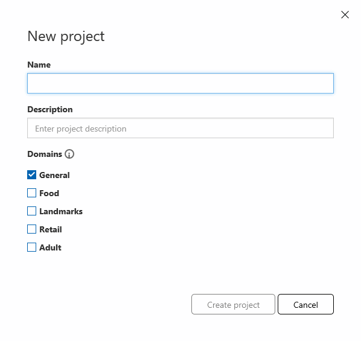
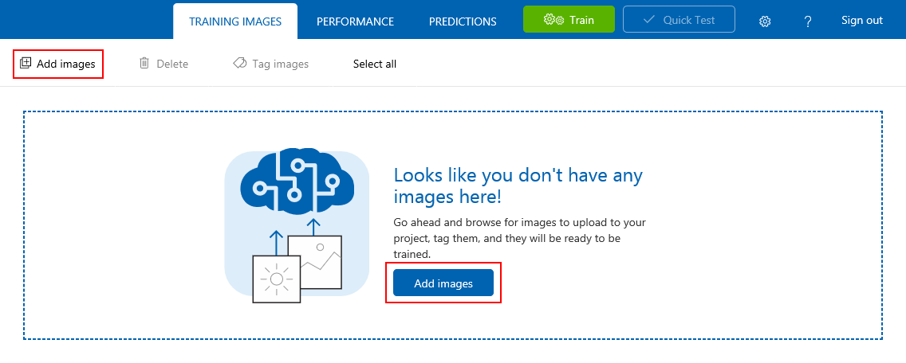
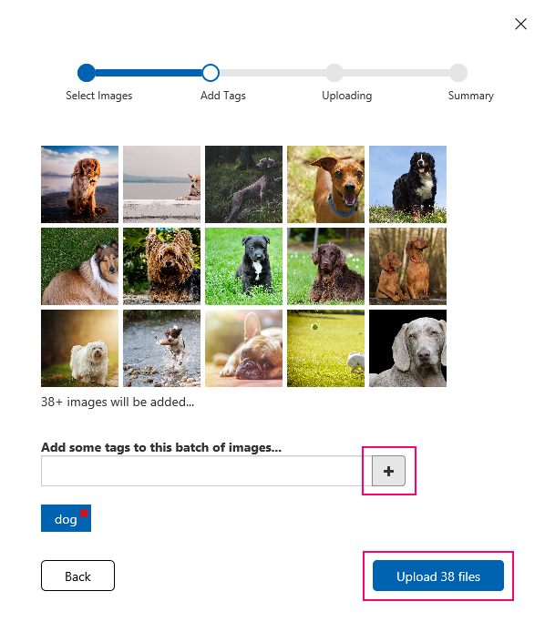
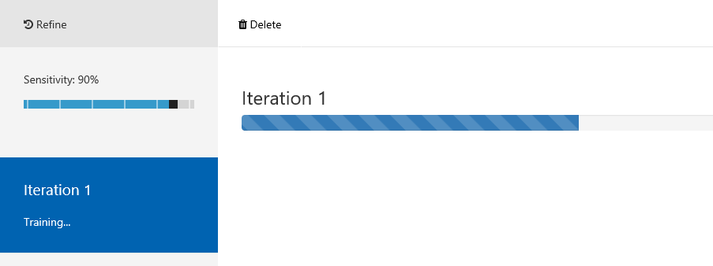
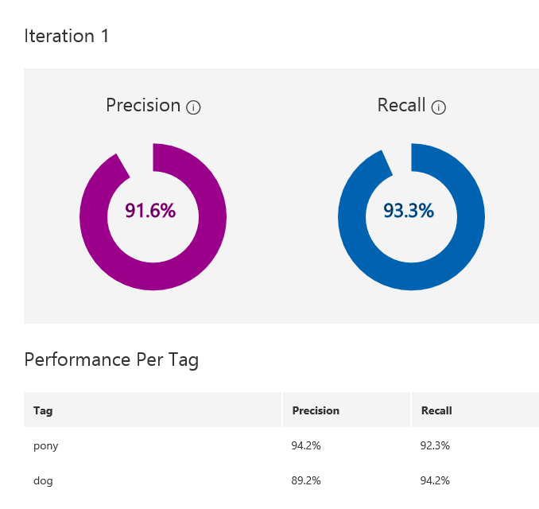
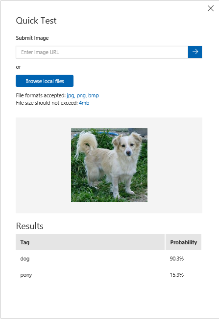

# Custom Vision - Cognitive Service Vision

## 登录地址
https://www.customvision.ai/

## 官方文档
https://docs.microsoft.com/en-us/azure/cognitive-services/custom-vision-service/getting-started-build-a-classifier

## 网站操作说明
### Custom Vision说明
Custom Vision Service是一个用于构建定制图像分类器的工具。例如，如果想要识别"雏菊"，"水仙花"和"大丽花"，可以通过自定义视觉服务，自己提供图像，训练一个分类器。自定义视觉服务是"图像分类"，不是“物体检测”。所以自定义视觉服务可以识别图像是否属于特定对象，但不能识别图像中的对象。创建分类器所需的图像非常少，每个类30个图像足以启动原型。

### 操作说明
1. 通过网站和微软账户登录custom vision服务，获得免费试用服务。
2.  创建新的工程project，选择识别领域用来优化算法。
- Generic	通用泛化
- Food	独立的水果或者蔬菜，餐厅食物
- Landmarks	自然或者人文地标
- Retail 购物目录或者电商网站上的图片
- Adult	成人内容和非成人内容
- Compact	移动设别的实时分类，模型能够导出到本地运行。



3. 添加图片进行训练
每个类最少30张，每张照片有不同的拍摄角度、灯光、背景、类型、组合、尺寸等。并为多张图片打标签。




4. 训练并读取精度

点击训练按钮


开始长达几分钟的训练过程



训练结果的精确度：
- Precision	分类器正确分类图片的概率。
- Recall	在所有本应正确分类的图片中，有多少真的分对了。



5. 预测
- 通过quick test按钮在网站中快速预测



- 通过prediction url按钮获取预测API

```Restful API
http://southcentralus.api.cognitive.microsoft.com/customvision/v1.0/prediction/d16e136c-5b0b-4b84-9341-6a3fff8fa7fe/image
```