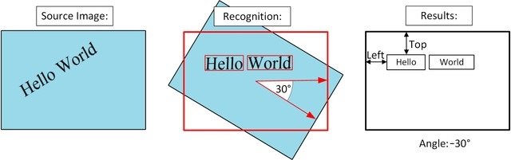

# OCR - Cognitive Service Vision

## Github
https://github.com/Azure-Samples/cognitive-services-javascript-computer-vision-tutorial

https://github.com/Microsoft/Cognitive-Vision-Android

## 官方文档
https://docs.microsoft.com/zh-cn/azure/cognitive-services/computer-vision/tutorials/javascript-tutorial

https://westus.dev.cognitive.microsoft.com/docs/services/56f91f2d778daf23d8ec6739/operations/56f91f2e778daf14a499e1fc

## Restful API说明
### OCR API说明

OCR API识别和提取图片中的文字。一旦分析完成，API返回一个json体，描述文字及其所在位置和角度。

输入方式: Raw image binary (application/octet stream) 或者是 image URL

图片格式: JPEG, PNG, BMP

图片尺寸: 小于 10 Megapixel

图片维度: 40 x 40 pixel 到3200 X 3200 pixel

支持语言：阿拉伯文，简体中文，中文繁体，捷克语，丹麦语，荷兰语，英语，芬兰语，法语，德语，希腊语，匈牙利语，意大利语，日语，韩语，挪威语，波兰语，葡萄牙语，罗马尼亚语，俄语，塞尔维亚语（西里尔语和拉丁），斯洛伐克语，西班牙语，瑞典语和土耳其语

支持旋转:



图像质量要求：不能是
- 模糊的图像
- 手写或草书文本
- 艺术字体或者小文字
- 复杂的背景，有阴影或有眩光
- 有下标，上标或删除线的文本

```Restful API
POST https://westus.api.cognitive.microsoft.com/vision/v1.0/ocr[?language][&detectOrientation]
```
- Parameter - lanuage: zh-Hans, en, ...
- Parameter - detectOrientation: true, false
- Header - Ocp-Apim-Subscription-Key
- Header - Content-Type: application/json, application/octet-stream
- Body: {"url":"http://example.com/images/test.jpg"} 或者是raw data

### Javascript demo说明
以ocr.html为例，没有对其他js文件的依赖，逻辑实现在html文件中。

1. 更新ocrButtonClick函数如下

```javascript
function ocrButtonClick() {

    // Clear the display fields.
    $("#sourceImage").attr("src", "#");
    $("#responseTextArea").val("");
    $("#captionSpan").text("");

    // Display the image.
    var sourceImageUrl = $("#inputImage").val();
    $("#sourceImage").attr("src", sourceImageUrl);

    ReadOcrImage(sourceImageUrl, $("#responseTextArea"));
}
```

2. 在ocrButtonClick函数后面添加AnalyzeImage函数

```javascript
function ReadOcrImage(sourceImageUrl, responseTextArea) {
    // Request parameters.
    var params = {
        "language": "unk",
        "detectOrientation ": "true",
    };

    // Perform the REST API call.
    $.ajax({
        url: common.uriBasePreRegion + 
             $("#subscriptionRegionSelect").val() + 
             common.uriBasePostRegion + 
             common.uriBaseOcr +
             "?" + 
             $.param(params),

        // Request headers.
        beforeSend: function(jqXHR){
            jqXHR.setRequestHeader("Content-Type","application/json");
            jqXHR.setRequestHeader("Ocp-Apim-Subscription-Key", 
                encodeURIComponent($("#subscriptionKeyInput").val()));
        },

        type: "POST",

        // Request body.
        data: '{"url": ' + '"' + sourceImageUrl + '"}',
    })

    .done(function(data) {
        // Show formatted JSON on webpage.
        responseTextArea.val(JSON.stringify(data, null, 2));
    })

    .fail(function(jqXHR, textStatus, errorThrown) {
        // Put the JSON description into the text area.
        responseTextArea.val(JSON.stringify(jqXHR, null, 2));

        // Display error message.
        var errorString = (errorThrown === "") ? "Error. " : errorThrown + " (" + jqXHR.status + "): ";
        errorString += (jqXHR.responseText === "") ? "" : (jQuery.parseJSON(jqXHR.responseText).message) ? 
            jQuery.parseJSON(jqXHR.responseText).message : jQuery.parseJSON(jqXHR.responseText).error.message;
        alert(errorString);
    });
}
```

3. 打开html页面，输入Vision key,所申请的区域，以及在线图片的url，进行测试。